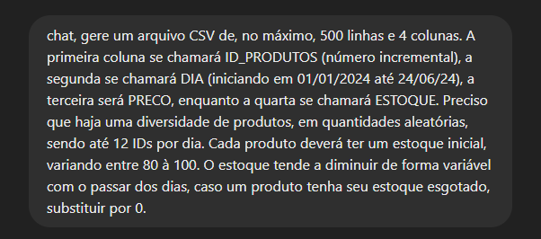
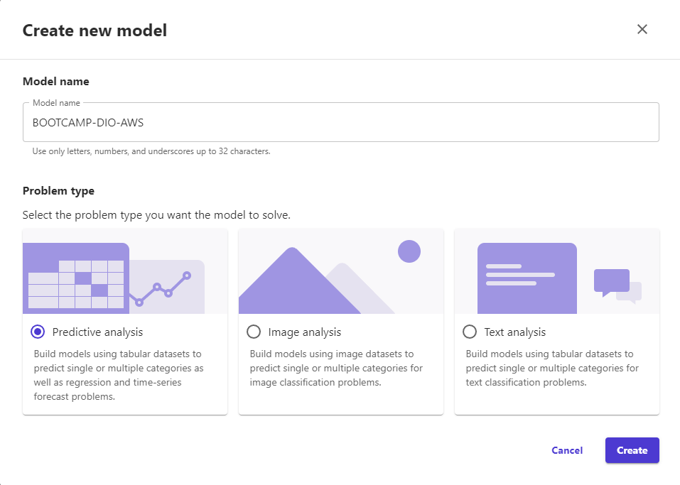
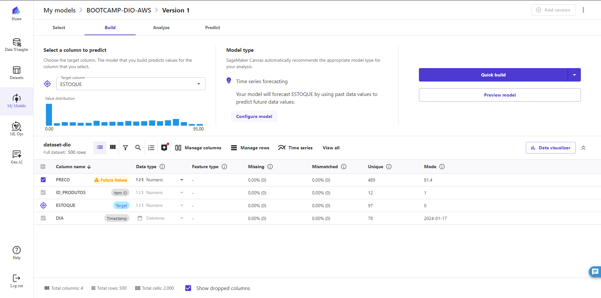
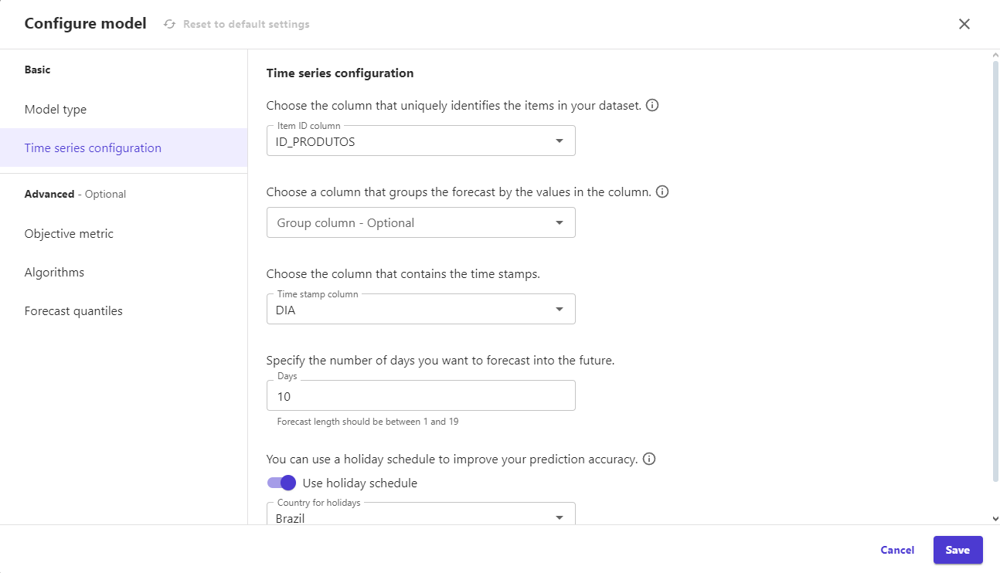
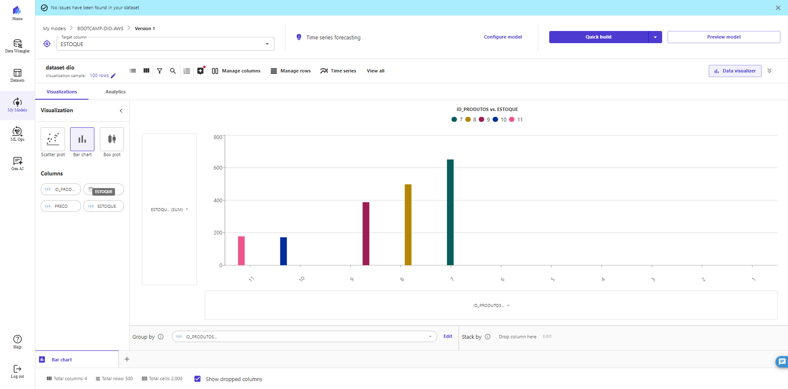

# Previsão de Estoque inteligente com SageMakers Canvas 

## Bootcamp Nexa - Machine Learning - DIO.

## Resumo

### O projeto final do bootcamp é utilizar um dataset para criar uma previsão de estoque inteligente baseando-se em Machine Learning No-Code através do SageMakers Canvas, da Amazon Web Service

###### Este repositório é um passo a passo seguido por mim até o objetivo do projeto, também como uma forma pessoal de aprendizado enquanto explico. Pode haver erros em termos técnicos, ou abordagens rasas sobre o assunto. Não é um repositório informativo. O resultado está ao final da página.

## Passo a Passo

### DATASET

- #### Meu dataset foi gerado através do generativo Chat-GPT, disponibilizado na pasta 'dataset', com as seguintes intruções:

### ☁️ SageMaker

- #### Fiz o upload do arquivo gerado pelo Chat-GPT e selecionei _Predective Analysis_ como meu _Problem type_, sendo ele direcionado a predizer meu estoque com base no histórico do arquivo CSV.

- #### Em _Select a column to predict_, selecionei a coluna ESTOQUE, a qual quero uma predição dos dados.

###### Há um aviso para a coluna PRECO. Segundo ao próprio SageMaker, é porque não há valores reais para os dias futuros onde serão feitas as predições, então decidi que ele trabalhará com a mediana entre os valores prescristos no arquivo CSV para finalização do projeto.

- #### Em _Configure Model_, selecionei a coluna ID_PRODUTOS para identificar os itens da coluna ESTOQUE. Enquanto a coluna DIA será o período em que ocorreu as ações do arquivo. Fiz uma previsão de até 3 dias.

- #### Há possibilidade de criar gráficos através do _Data Visualizer_

